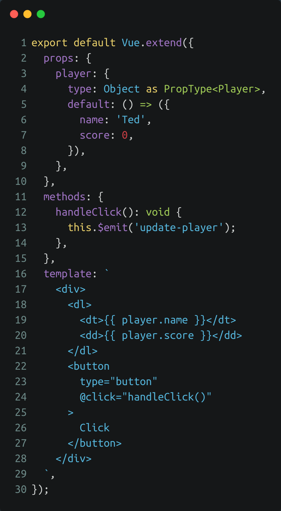

<!-- section-title: Intro -->
## What's the issue with Vue2?
- Supports Typescript out of the box but with limited type interference inside vue components
- Multiple alternatives like Vue Class Components or Vue with TSX tried to improve Typescript handling
- Has some limitations of the reactivity system
- Template limitations make components more difficult to build and style
- Has duplicate functionality (two way data-binding etc.)

---

## Example Vue2 app

<!-- block-start: grid -->
<!-- block-start: column -->
<!-- classes: grid -->

[Example Vue2 - parent component](http://127.0.0.1:8085/examples/vue2-issues-1)

<!-- block-end -->
<!-- block-start: column -->

[Example Vue2 - child component](http://127.0.0.1:8085/examples/vue2-issues-1)

<!-- block-end -->
<!-- block-end -->

<!-- ---

## Motivation for Vue 3.0
- Much better Typescript integration
- Remove Vue2 reactivity issues
- Unify and extend data binding (v-model vs .sync, multiple v-models)
- Simplify code reuse (composable functions)
- Allow modern JS-features (arrow functions etc.) -->
