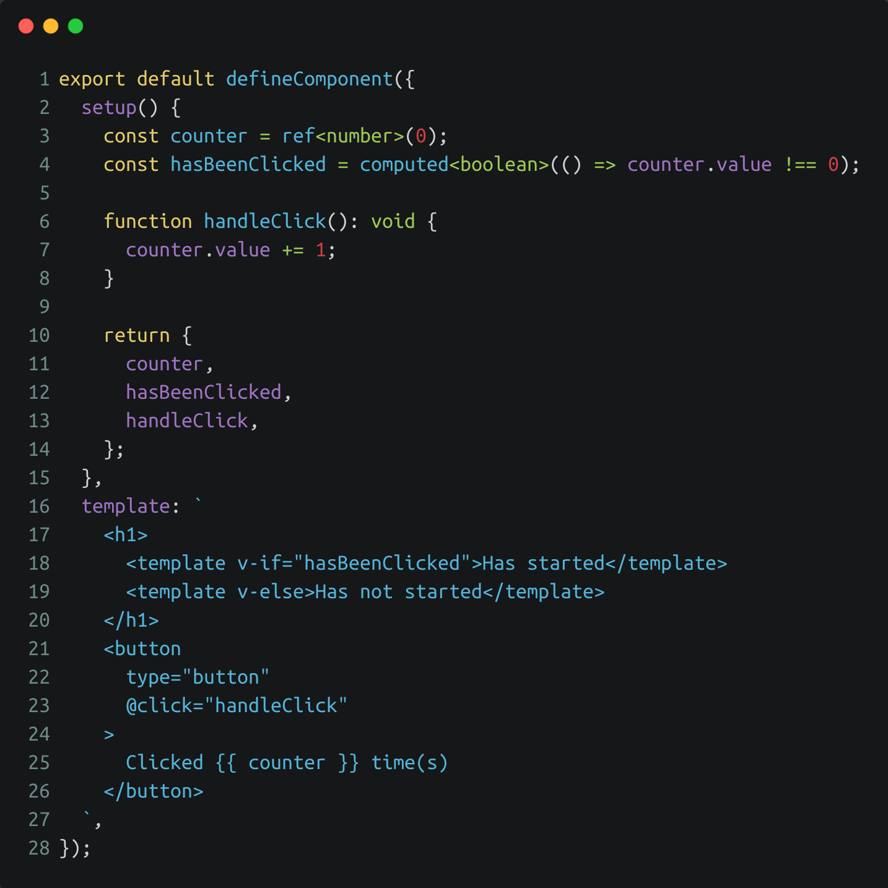

<!-- section-title: Intro -->
## What's the issue with Vue 2.0?
- Vue 2.0 came out in September 2016 -> Predating a lot of modern JS features
- Supported Typescript out of the box but with limited type interference inside vue components - Lot of manual typing required
- Multiple alternatives like Vue Class Components or Vue with TSX tried to improve Typescript handling -> Fragmentation
- Has some limitations of the reactivity system (Vue.set etc.) -> Occasional Annoyance
- Duplicate functionality (two way data-binding) -> Larger api-surface

---

## Example Vue2 app

<!-- block-start: grid -->
<!-- block-start: column -->
<!-- classes: grid.sm -->
- Text

<!-- block-end -->
<!-- block-start: column -->

[Example XYZ](http://127.0.0.1:8085/examples/composition-api-1/)

<!-- block-end -->
<!-- block-end -->

---

## Motivation for Vue 3.0
- Much better Typescript integration
- Remove Vue2 reactivity issues
- Unify and extend data binding (v-model vs .sync, multiple v-models)
- Simplify code reuse (composable functions)
- Allow modern JS-features (arrow functions etc.)
