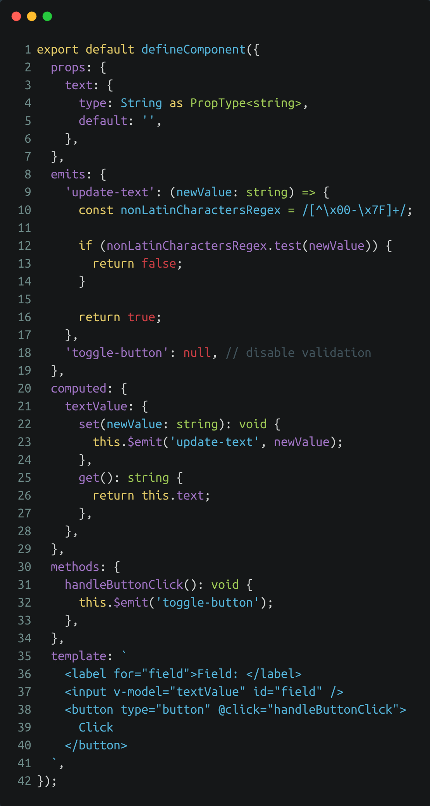
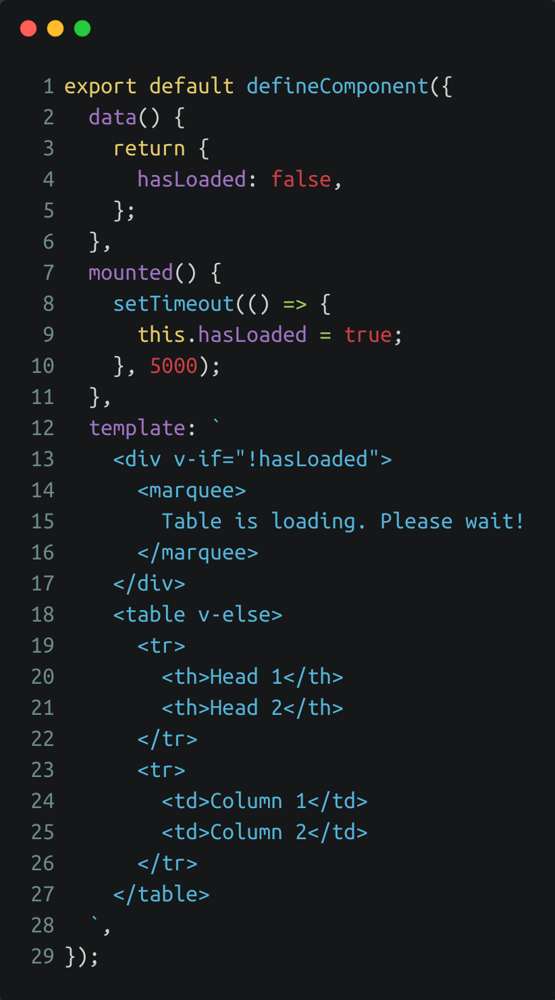

<!-- section-title: New features & Improvements -->
## New features & Improvements

---
### Composition API
<!-- block-start: grid -->
<!-- block-start: column -->
<!-- classes: grid -->
- Improves compatibility with Typescript
- Improves readability/code organization
- Provides data encapsulation
- Simplifies scope handling
<!-- - Simpler way to split code and share functionality -->
<!-- - Improves working with JSX and TSX -->
<!-- - Allows usage of arrow functions for computed, methods etc. -->
- Further fragmentation of the Vue ecosystem
- Changes approach to unit testing
- Still actively changing (script setup)

<!-- block-end -->
<!-- block-start: column -->

[Example Composition API](http://127.0.0.1:8085/examples/composition-api-1/)

<!-- block-end -->
<!-- block-end -->

---
### Better reactivity
- Vue3 uses proxy objects for reactivity
- Objects are now fully reactive by default without any change detection issues
- Objects can be made partially reactive
- Requires evergreen browsers (newer than IE11)
- Makes destructuring slightly more complicated

---
### Multiple v-model attributes for two-way data-binding
<!-- block-start: grid -->
<!-- block-start: column -->
<!-- classes: grid -->
- Two-way data-binding mostly used for form-elements within components and child to parent communication on custom components
- v-model and sync-modifier are used for two way data-binding in Vue2
- sync-modifier has been removed in Vue3
- Vue3 allows multiple v-models per component

<!-- block-end -->
<!-- block-start: column -->

[Example v-model in custom components](http://127.0.0.1:8085/examples/v-model-1)

<!-- block-end -->
<!-- block-end -->

---
### Event-validation and Event-documentation
<!-- block-start: grid -->
<!-- block-start: column -->
<!-- classes: grid -->
- Events can now be validated via emit property
- See at a glance which events are emitted by a component and check the validity of emitted event parameters
- Can be simple string array for documentation only
- Can be an object of callback functions or validator functionality
- Eslint shows warning when events that are used are missing in the emits property

<!-- block-end -->
<!-- block-start: column -->

[Example event validation](http://127.0.0.1:8085/examples/emits-1/)

<!-- block-end -->
<!-- block-end -->

---
### Multiple root nodes in templates
<!-- block-start: grid -->
<!-- block-start: column -->
<!-- classes: grid -->
- Templates can now have multiple root elements
- No more wrapper elements necessary
- Class-attribute placement needs to be handled manually
- Key placement slightly more complex when using template-tags with v-for

<!-- block-end -->
<!-- block-start: column -->

[Example multi-root elements](http://127.0.0.1:8085/examples/multi-root-1)

<!-- block-end -->
<!-- block-end -->