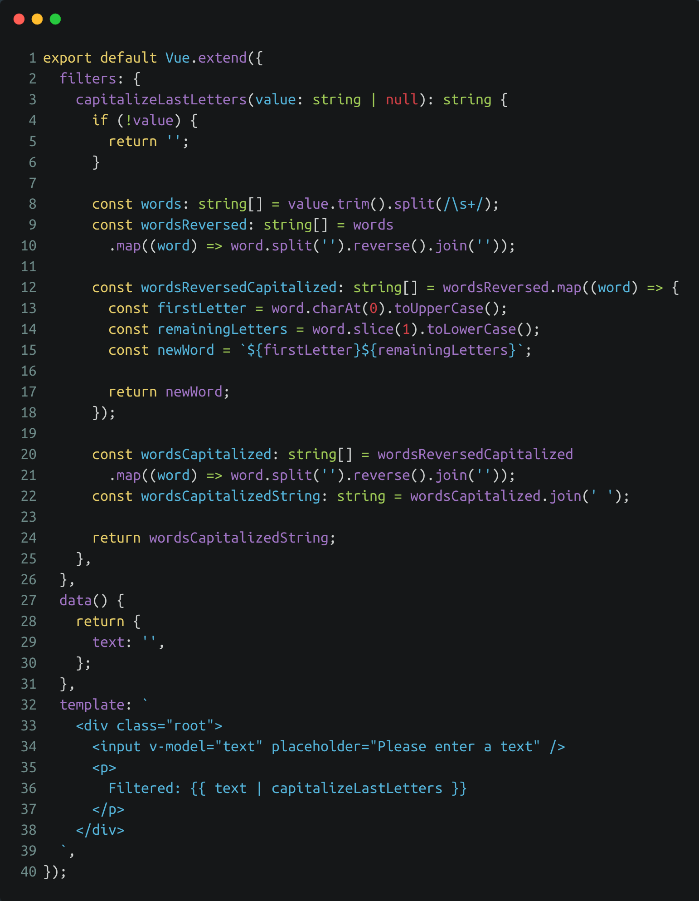

<!-- section-title: Breaking changes -->
## Breaking changes

---
### Filter removal
<!-- block-start: grid -->
<!-- block-start: column -->
<!-- classes: grid.sm -->
- Filter syntax was original taken from AngularJS
- Often used for output formatting like currencies, dates, text manipulation etc.
- Pure functions with no access to component state
- Can be replaced with regular functions or computed properties

<!-- block-end -->
<!-- block-start: column -->

[Example Composition API](http://127.0.0.1:8085/examples/vue2-filter-1/)

<!-- block-end -->
<!-- block-end -->

---
### v-if & v-for precedence
<!-- block-start: grid -->
<!-- block-start: column -->
<!-- classes: grid.sm -->
- using both directives at the same time on the same element should be avoided and will result in a linter warning
- Vue2 executes v-for first and creates a temporary object which is then used by v-if to check if the condition is fulfilled. Loop has to be run and condition executed whenever the component rerenders
- Vue3 executes v-if first and doesn't render anything as there is no age variable in scope, which causes a warning
- can be refactored into a computed property that pre-filters and caches the elements
- for conditional rendering (if empty) an additional computed property like hasEntries or wrapping the container with an entries.length check can be used. Alternatively v-if and v-else can be moved into the loop using two template-tags

<!-- block-end -->
<!-- block-start: column -->
Screenshot

<!-- block-end -->
<!-- block-end -->

---
### v-model naming changes and .sync removal
<!-- block-start: grid -->
<!-- block-start: column -->
<!-- classes: grid.sm -->
- Text

<!-- block-end -->
<!-- block-start: column -->
Screenshot

<!-- block-end -->
<!-- block-end -->

---
### Other minor breaking changes
- New naming conventions for event-names
- Key placement
- Browser support
- Template tag rendering
