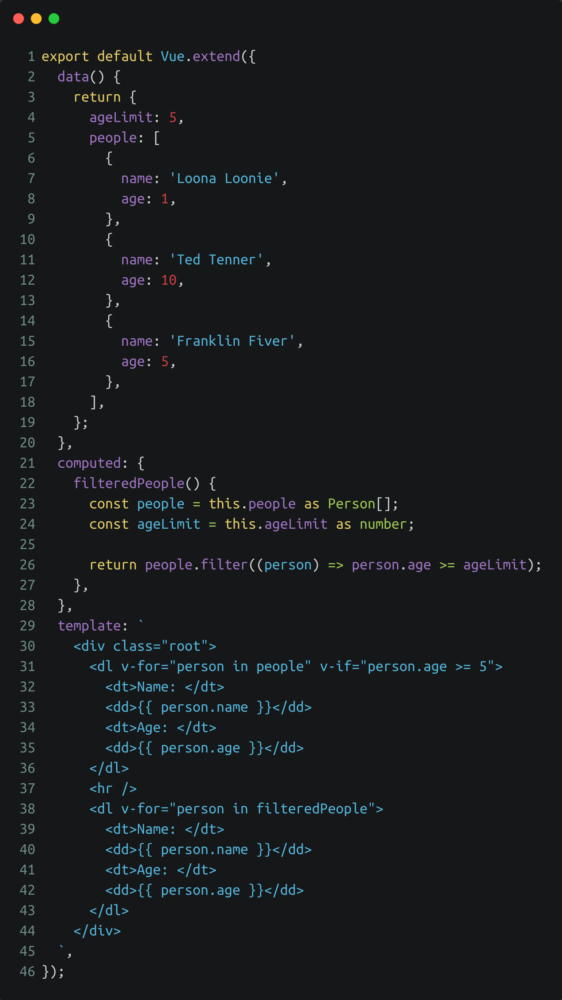
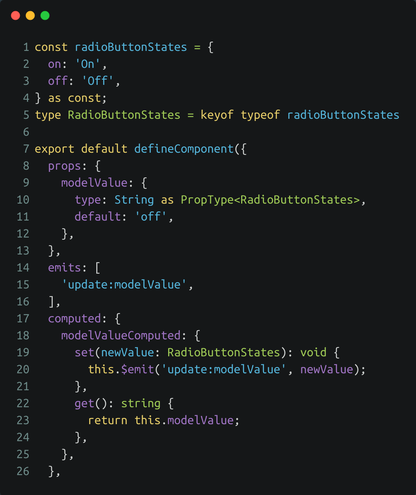

<!-- section-title: Breaking changes -->
## Breaking changes

---
### Filter removal
<!-- block-start: grid -->
<!-- block-start: column -->
<!-- classes: grid -->
- Filter syntax was original taken from AngularJS
- Often used for output formatting of currencies, dates and strings
- Pure functions with no access to component state
- Can be replaced with regular functions or computed properties

<!-- block-end -->
<!-- block-start: column -->

[Example filters Vue2](http://127.0.0.1:8085/examples/vue2-filter-1/)

<!-- block-end -->
<!-- block-end -->

---
### v-if & v-for precedence swap
<!-- block-start: grid -->
<!-- block-start: column -->
<!-- classes: grid -->
- Using both directives at the same time should be avoided and will result in a linter warning
- Vue2 executes **v-for** first and creates a temporary object which is then used by **v-if** to check if the condition is fulfilled.
- Vue3 executes **v-if** first and doesn't render anything as there is no age variable in scope, which causes a warning
- Can be refactored into a computed property that filters and caches the results
- For conditional rendering an additional computed property like hasResults can be used

<!-- block-end -->
<!-- block-start: column -->

[Example v-if and v-for](http://127.0.0.1:8085/examples/vue2-v-for-v-if-1/)

<!-- block-end -->
<!-- block-end -->

---
### .sync removal and v-model name changes in custom components
<!-- block-start: grid -->
<!-- block-start: column -->
<!-- classes: grid -->
- .sync-attribute has been dropped in Vue3 and needs to be replaced with v-model
- Name of v-model props have changed and differ between components with single v-model and multiple v-models
<!-- - Option to customize the name of the v-model prop and emitted event via the model object has been removed again -->
- For custom components that use a single v-model attribute, the naming convention is the following:
- Name of the v-model attribute on the parent component: `v-model` or `v-model:modelValue`
- Name of the emitted event: `update:modelValue`
- V-model prop name: `modelValue`

<!-- block-end -->
<!-- block-start: column -->

[Example single v-model](http://127.0.0.1:8085/examples/v-model-2/)

<!-- block-end -->
<!-- block-end -->

---

### .sync removal and v-model name changes in custom components
<!-- block-start: grid -->
<!-- block-start: column -->
<!-- classes: grid -->
- For custom components that use multiple v-model attributes, the naming convention is the following:
- Name of the v-model attribute on the parent component: `v-model:nameOfVariable`
- Name of the emitted event: `update:nameOfVariable`
- V-model prop name: `nameOfVariable` not `modelValue:nameOfVariable`

<!-- block-end -->
<!-- block-start: column -->

[Example multiple v-model](http://127.0.0.1:8085/examples/v-model-1/)

<!-- block-end -->
<!-- block-end -->

---
### Other minor breaking changes
- Recommended naming conventions for event-names has changed
- Key placement on multi-root components
- Template tag rendering
- Browser support
